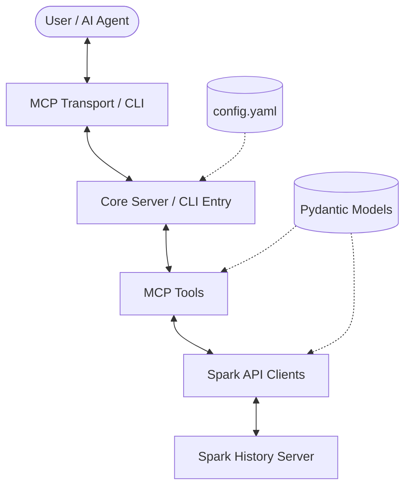

# 🛠️ Technical Contribution Guide

This guide provides a deep dive into the technical architecture, file structure, and internal logic of the Spark History Server MCP project. It is intended for developers who want to understand how the system works and how to extend it.

## 🏗️ Architecture Overview

The project is built as a **Model Context Protocol (MCP)** server that provides tools for analyzing and comparing Apache Spark applications. It also includes a **CLI** for direct human interaction.

### 🧩 High-Level Components



1.  **Transport Layer**: Handles communication via MCP (stdio/SSE) or CLI.
2.  **Core Layer**: Manages server lifecycle, configuration loading, and tool registration.
3.  **Tools Layer**: Implements the actual logic for analysis, comparison, and data retrieval.
4.  **API Layer**: Provides a clean Python interface to the Spark History Server REST API.
5.  **Models Layer**: Defines the data structures used throughout the application.

---

## 📁 File Structure

```text
src/spark_history_mcp/
├── api/                # Spark History Server API abstraction
│   ├── base_client.py  # Abstract base for API clients
│   ├── factory.py      # Factory to create appropriate clients (REST, EMR, etc.)
│   ├── spark_client.py # Main REST API client implementation
│   └── ...
├── cli/                # Command-Line Interface
│   ├── commands/       # Click command definitions
│   ├── formatters.py   # Rich-based output formatting
│   ├── main.py         # CLI entry point
│   └── ...
├── config/             # Configuration management
│   └── config.py       # Pydantic-based configuration models
├── core/               # Core server logic
│   ├── app.py          # FastMCP server definition & lifecycle
│   └── main.py         # Unified entry point (MCP or CLI)
├── models/             # Data models
│   ├── spark_types.py  # Pydantic models for Spark REST API (40KB+)
│   └── mcp_types.py    # MCP-specific type definitions
├── prompts/            # MCP Prompts
│   ├── optimization.py # Optimization suggestion prompts
│   └── ...
├── tools/              # MCP Tool implementations
│   ├── analysis.py     # Performance & bottleneck analysis
│   ├── application.py  # App-level data tools
│   ├── executors.py    # Executor-level tools
│   ├── jobs_stages.py  # Job & Stage tools
│   ├── comparison_modules/ # Complex comparison logic
│   └── ...
└── utils/              # Shared helper functions
```

---

## 🧠 Main Logic Flow

### 1. Bootstrapping (Entry Point)
The entry point is `src/spark_history_mcp/core/main.py`. It checks for the `--cli` flag:
- **CLI Mode**: Calls `cli()`, which uses `Click` to route to subcommands in `cli/commands/`.
- **MCP Mode**: Calls `app.run()`, starting the `FastMCP` server.

### 2. Lifecycle Management
In `core/app.py`, the `app_lifespan` context manager:
1.  Loads `config.yaml`.
2.  Initializes `SparkRestClient` (or specialized clients like `EMRPersistentUIClient`) for each configured server.
3.  Makes these clients available to tools via the `AppContext`.

### 3. Tool Execution
All tools (in `tools/`) follow a similar pattern:
1.  Retrieve the appropriate client using `get_client_or_default()`.
2.  Fetch raw data using `client.get_stage()`, `client.get_executor_summary()`, etc.
3.  Process the data using `models/spark_types.py` for type-safe manipulation.
4.  Perform analysis (e.g., calculating skew, identifying bottlenecks).
5.  Return the result (usually as a Pydantic model or a formatted string).

---

## 🔍 Logic Details by Module

### 📡 API Clients (`api/`)
- **`BaseApiClient`**: Handles HTTP communication, retries, and error handling using `requests`.
- **`SparkRestClient`**: Maps Python methods to Spark REST API endpoints (e.g., `/api/v1/applications/{app_id}/stages`). It handles URL prefixing and attempt ID injection.
- **`EMRPersistentUIClient`**: Specialized client for AWS EMR, handling its specific authentication and URL structure.

### 🛠️ Tools (`tools/`)
- **`analysis.py`**:
    - `get_job_bottlenecks`: Identifies stages with high "duration per task" or large skew.
    - `analyze_shuffle_skew`: Compares median vs. max shuffle read/write across tasks in a stage.
- **`comparison_modules/`**:
    - Implements logic to compare two Spark applications or stages.
    - Logic focuses on identifying differences in configuration, task durations, and resource utilization.
- **`application.py`**:
    - Provides high-level summaries and insights by aggregating data from jobs, stages, and executors.

### 📊 Models (`models/`)
- **`spark_types.py`**: A very detailed set of Pydantic models. Every Spark REST API response is mapped to a model, ensuring that the rest of the codebase has full IDE support and runtime validation for Spark data.

### 💻 CLI (`cli/`)
- The CLI uses `Rich` to render tables and formatted text.
- It shares the same logic as the MCP tools but includes additional "formatting" layers to make the output human-readable.

---

## 💡 Guidelines for Extension

### Adding a New API Endpoint
1.  Check if the model already exists in `models/spark_types.py`. If not, add it.
2.  Add a method to `SparkRestClient` in `api/spark_client.py`.
3.  Test the new method directly in the client.

### Adding a New MCP Tool
1.  Implement the logic in a new or existing file in `tools/`.
2.  Use the `@mcp.tool()` decorator.
3.  Ensure the tool is imported in `tools/__init__.py`.
4.  If it's useful for humans, add a corresponding command in `cli/commands/`.

### Modifying Comparison Logic
1.  Focus on `tools/comparison_modules/`.
2.  Update the relevant module (e.g., `executors.py` for executor comparisons).
3.  Ensure that both the MCP tool and the CLI command (which usually calls these modules) still work correctly.
