# SparkInsight AI

[](https://github.com/DeepDiagnostix-AI/sparkinsight-ai/actions)
[](https://www.python.org/downloads/)
[](https://modelcontextprotocol.io/)
[](https://opensource.org/licenses/Apache-2.0)

> **🧠 AI-Powered Spark Analysis with MCP Integration for intelligent performance monitoring and optimization**

Connect AI agents to Apache Spark History Server for intelligent job analysis, bottleneck detection, and optimization recommendations through natural language queries.

**Key Features:**
- 🔍 Natural language queries for Spark job analysis
- 📊 AI-powered performance insights and bottleneck detection
- 🔄 Historical job comparison and regression analysis
- 🚨 Intelligent failure investigation and root cause analysis

📺 **[Watch Demo Video](https://www.youtube.com/watch?v=e3P_2_RiUHw)** | 📸 **[View Screenshots](screenshots/)**


## 🏗️ Architecture

```mermaid
graph TB
    A[🤖 AI Agent/LLM] --> F[📡 MCP Client]
    B[🦙 LlamaIndex Agent] --> F
    C[🌐 LangGraph] --> F
    D[�️ Claudep Desktop] --> F
    E[🛠️ Amazon Q CLI] --> F

    F --> G[⚡ Spark History MCP Server]

    G --> H[🔥 Prod Spark History Server]
    G --> I[🔥 Staging Spark History Server]
    G --> J[🔥 Dev Spark History Server]

    H --> K[📄 Prod Event Logs]
    I --> L[📄 Staging Event Logs]
    J --> M[📄 Dev Event Logs]
```



**Components:** AI agents connect through MCP to your existing Spark History Servers for intelligent analysis.

## ⚡ Quick Start

### 📋 Prerequisites
- Python 3.12+
- [uv](https://docs.astral.sh/uv/getting-started/installation/) package manager
- Existing Spark History Server (or use our test setup)

### 🚀 Installation & Setup

```bash
# Install directly from PyPI
uvx --from sparkinsight-ai sparkinsight-ai

# Start with configuration
sparkinsight-ai config init --interactive

# Start the MCP server
sparkinsight-ai server start
```

### 🧪 Development & Testing

```bash
# Clone for development and testing
git clone https://github.com/DeepDiagnostix-AI/sparkinsight-ai.git
cd sparkinsight-ai

# Install Task runner
brew install go-task  # macOS

# Start test environment
task start-spark-bg    # Start Spark History Server with sample data
task start-mcp-bg      # Start MCP Server
task start-inspector-bg # Start MCP Inspector (optional)

# Stop all services
task stop-all
```

## 🖥️ Command Line Interface

SparkInsight AI includes a comprehensive CLI for direct analysis without MCP clients.

```bash
# Basic usage
sparkinsight-ai config init --interactive
sparkinsight-ai apps list
sparkinsight-ai analyze insights <app-id>
sparkinsight-ai analyze bottlenecks <app-id>
```

**Command Categories:**
- **Apps**: `list`, `show`, `jobs`, `stages`, `executors`
- **Analysis**: `insights`, `bottlenecks`, `auto-scaling`, `shuffle-skew`
- **Server**: `start`, `test`, `status`
- **Config**: `init`, `show`, `validate`

📚 **See [CLI.md](CLI.md) for detailed usage examples and configuration options.**

## 🛠️ Available MCP Tools

The server provides **22 specialized tools** for AI agents organized by analysis patterns:

| Category | Tools | Purpose |
|----------|-------|---------|
| **📊 Applications** | `get_application`, `list_applications` | Basic application metadata and overview |
| **🔗 Jobs** | `list_jobs`, `list_slowest_jobs` | Job-level performance analysis |
| **⚡ Stages** | `list_stages`, `get_stage`, `list_slowest_stages`, `get_stage_task_summary` | Stage-level deep dive and task metrics |
| **🖥️ Executors** | `list_executors`, `get_executor`, `get_executor_summary`, `get_resource_usage_timeline` | Resource utilization and allocation tracking |
| **🔎 SQL** | `list_slowest_sql_queries`, `compare_sql_execution_plans` | SQL performance analysis |
| **🚨 Analysis** | `get_job_bottlenecks`, `compare_job_performance`, `compare_job_environments` | Bottleneck identification and comparison |
| **🧠 Intelligence** | `analyze_auto_scaling`, `analyze_shuffle_skew`, `analyze_failed_tasks`, `get_application_insights` | AI-powered optimization insights |

**Example AI Queries:**
- *"Why is my job slow?"* → Analyzes bottlenecks, stages, and executors
- *"Compare today vs yesterday"* → Compares performance and configurations
- *"Check for data skew"* → Analyzes shuffle patterns and task distribution

🔧 **See [TOOLS.md](TOOLS.md) for complete tool documentation and usage patterns.**

## 🚀 Deployment & Integration

**Deployment Options:**
- **Local/Development**: Use the quick start above
- **AWS**: Supports Glue and EMR - see [AWS guides](examples/aws/)
- **Kubernetes**: Helm charts available in [`deploy/kubernetes/`](deploy/kubernetes/)
- **Multi-server**: Configure multiple Spark History Servers

**AI Agent Integrations:**
- [Claude Desktop](examples/integrations/claude-desktop/) (STDIO)
- [Amazon Q CLI](examples/integrations/amazon-q-cli/) (STDIO)
- [Gemini CLI](examples/integrations/gemini-cli/) (STDIO)
- [LangGraph](examples/integrations/langgraph/) (HTTP)
- [Local Testing](TESTING.md) (HTTP)

🔧 **See [DEPLOYMENT.md](DEPLOYMENT.md) for detailed setup guides and configuration options.**

## 🎯 Use Cases

**Performance Investigation**
- *"Why is my ETL job slow?"* → Analyzes metrics, compares historical performance, identifies bottlenecks

**Failure Analysis**
- *"What caused job failures?"* → Examines failed tasks, reviews executor logs, suggests fixes

**Optimization**
- *"How can I optimize resource usage?"* → Analyzes auto-scaling, detects data skew, tracks utilization

📚 **See [EXAMPLES.md](EXAMPLES.md) for detailed use case scenarios and query examples.**

## 🤝 Contributing

Check [CONTRIBUTING.md](CONTRIBUTING.md) for full guidelines on contributions

## 📄 License

Apache License 2.0 - see [LICENSE](LICENSE) file for details.


## 📝 Trademark Notice

*This project is built for use with Apache Spark™ History Server. Not affiliated with or endorsed by the Apache Software Foundation.*

---

## 📚 Documentation

- **[CLI.md](CLI.md)** - Complete command-line interface guide
- **[TOOLS.md](TOOLS.md)** - All 22 MCP tools with examples
- **[DEPLOYMENT.md](DEPLOYMENT.md)** - AWS, Kubernetes, and multi-server setup
- **[EXAMPLES.md](EXAMPLES.md)** - Detailed use cases and query patterns
- **[TESTING.md](TESTING.md)** - Testing guide and sample data

---

<div align="center">

**🔥 Connect your Spark infrastructure to AI agents**

[🚀 Get Started](#-quick-start) | [🖥️ CLI Guide](CLI.md) | [🛠️ View Tools](TOOLS.md) | [🚀 Deploy](DEPLOYMENT.md)

*Built by the community, for the community* 💙

</div>
