# MCP Server for Apache Spark History Server

[](https://github.com/DeepDiagnostix-AI/mcp-apache-spark-history-server/actions)
[](https://www.python.org/downloads/)
[](https://modelcontextprotocol.io/)
[](https://opensource.org/licenses/Apache-2.0)

> **🤖 Connect AI agents to Apache Spark History Server for intelligent job analysis and performance monitoring**

Transform your Spark infrastructure monitoring with AI! This Model Context Protocol (MCP) server enables AI agents to analyze job performance, identify bottlenecks, and provide intelligent insights from your Spark History Server data.

**✨ Now featuring SparkInsight-inspired intelligent analysis tools** for auto-scaling optimization, data skew detection, failure analysis, and comprehensive performance insights!

## 🎯 What is This?

**Spark History Server MCP** bridges AI agents with your existing Apache Spark infrastructure, enabling:

- 🔍 **Query job details** through natural language
- 📊 **Analyze performance metrics** across applications
- 🔄 **Compare multiple jobs** to identify regressions
- 🚨 **Investigate failures** with detailed error analysis
- 📈 **Generate insights** from historical execution data

📺 **See it in action:**

[](https://www.youtube.com/watch?v=e3P_2_RiUHw)


## 🏗️ Architecture

```mermaid
graph TB
    A[🤖 AI Agent/LLM] --> F[📡 MCP Client]
    B[🦙 LlamaIndex Agent] --> F
    C[🌐 LangGraph] --> F
    D[�️ Claudep Desktop] --> F
    E[🛠️ Amazon Q CLI] --> F

    F --> G[⚡ Spark History MCP Server]

    G --> H[🔥 Prod Spark History Server]
    G --> I[🔥 Staging Spark History Server]
    G --> J[🔥 Dev Spark History Server]

    H --> K[📄 Prod Event Logs]
    I --> L[📄 Staging Event Logs]
    J --> M[📄 Dev Event Logs]
```



**🔗 Components:**
- **🔥 Spark History Server**: Your existing infrastructure serving Spark event data
- **⚡ MCP Server**: This project - provides MCP tools for querying Spark data
- **🤖 AI Agents**: LangChain, custom agents, or any MCP-compatible client

## ⚡ Quick Start

The server supports **dual-mode operation**:
- 🤖 **MCP Server Mode** (default) - For AI agents and LLM integration
- 🖥️ **CLI Mode** (new!) - Direct command-line interface for human users

### 📋 Prerequisites
- 🔥 Existing Spark History Server (running and accessible)
- 🐍 Python 3.12+
- ⚡ [uv](https://docs.astral.sh/uv/getting-started/installation/) package manager

### 🚀 Setup & Testing

```bash
git clone https://github.com/DeepDiagnostix-AI/mcp-apache-spark-history-server.git
cd mcp-apache-spark-history-server

# Install Task (if not already installed)
brew install go-task  # macOS, see https://taskfile.dev/installation/ for others

# Setup and start testing
task start-spark-bg            # Start Spark History Server with sample data (default Spark 3.5.5)
# Or specify a different Spark version:
# task start-spark-bg spark_version=3.5.2
task start-mcp-bg             # Start MCP Server

# Optional: Opens MCP Inspector on http://localhost:6274 for interactive testing
# Requires Node.js: 22.7.5+ (Check https://github.com/modelcontextprotocol/inspector for latest requirements)
task start-inspector-bg       # Start MCP Inspector

# When done, run `task stop-all`
```

## 🖥️ CLI Mode (New!)

**Direct command-line interface** for human users - no MCP client required!

### 🚀 Quick CLI Setup
```bash
# Clone and install
git clone https://github.com/DeepDiagnostix-AI/mcp-apache-spark-history-server.git
cd mcp-apache-spark-history-server
uv sync

# Try CLI commands immediately
uv run spark-mcp --cli apps list --limit 5
uv run spark-mcp --cli --help
```

### 🎯 CLI Examples
```bash
# List applications with beautiful formatting
uv run spark-mcp --cli apps list --limit 10 --format table

# Get comprehensive insights
uv run spark-mcp --cli analyze insights app-20231201-123456

# Compare applications (new stateful approach)
uv run spark-mcp --cli apps compare "ETL Pipeline"        # Auto-compare last 2 matching
uv run spark-mcp --cli apps compare app1 app2             # Compare specific IDs
uv run spark-mcp --cli apps compare app1 app2 --all       # Show all executor metrics

# Interactive configuration
uv run spark-mcp --cli config init --interactive

# Test server connectivity
uv run spark-mcp --cli server test
```

### 📊 Rich Output Formats
- **Human** (default): Beautiful tables and panels with colors
- **JSON**: Machine-readable for scripting
- **Table**: Simple tabular format

📚 **[See CLI-README.md](CLI-README.md) for complete CLI documentation**
📚 **[MCP Tools Reference](docs/mcp-tools.md) (responses + samples)**

---

If you just want to run the MCP server without cloning the repository:

```bash
# Run with uv without installing the module
uvx --from mcp-apache-spark-history-server spark-mcp

# OR run with pip and python. Use of venv is highly encouraged.
python3 -m venv spark-mcp && source spark-mcp/bin/activate
pip install mcp-apache-spark-history-server
python3 -m spark_history_mcp.core.main
# Deactivate venv
deactivate
```


### 📊 Sample Data
The repository includes real Spark event logs for testing:
- `spark-bcec39f6201b42b9925124595baad260` - ✅ Successful ETL job
- `spark-110be3a8424d4a2789cb88134418217b` - 🔄 Data processing job
- `spark-cc4d115f011443d787f03a71a476a745` - 📈 Multi-stage analytics job

See **[TESTING.md](TESTING.md)** for using them.

### ⚙️ Server Configuration
Edit `config.yaml` for your Spark History Server:
```yaml
servers:
  local:
    default: true
    url: "http://your-spark-history-server:18080"
    auth:  # optional
      username: "user"
      password: "pass"
mcp:
  transports:
    - streamable-http # streamable-http or stdio.
  port: "18888"
  debug: true
```

## 📸 Screenshots

### 🔍 Get Spark Application


### ⚡ Job Performance Comparison


## 🚀 Major Enhancements Beyond Original Fork

This MCP server has been significantly enhanced with advanced capabilities far beyond the original forked functionality:

### 📈 **Massive Tool Expansion**
- **18 original tools** → **50+ current tools** (3x growth)
- **Comprehensive comparison suite** with 8 advanced tools for cross-application analysis
- **Timeline-based analysis** with intelligent interval merging and executor-focused comparisons

### 🧠 **SparkInsight Intelligence Integration**
- **5 AI-powered analysis tools** inspired by SparkInsight for intelligent performance optimization
- **Auto-scaling recommendations** based on workload pattern analysis
- **Data skew detection** with actionable optimization suggestions
- **Failure analysis** with root cause identification
- **Executor utilization tracking** for resource optimization

### 💬 **Intelligent Prompts System**
- **16 structured prompts** for systematic Spark analysis
- **Domain expertise** encoded into reusable templates
- **Tailored analysis** for different audiences (technical vs executive)
- **Consistent methodology** across performance investigations

### ⏰ **Advanced Timeline Analysis**
- **Executor timeline comparisons** at both application and stage levels
- **Simplified output focus** removing noise from memory/CPU metrics
- **Intelligent interval merging** for cleaner analysis
- **Resource allocation pattern** tracking over time

### 🎯 **Enhanced Comparative Analysis**
- **Multi-dimensional comparisons**: resources, executors, jobs, stages
- **Comprehensive performance analysis** with stage-level deep dives
- **Significance filtering** to highlight meaningful differences
- **Actionable recommendations** for optimization

Tools marked with 🆕 represent major additions beyond the original fork functionality.

## 🛠️ Available Tools

> **Note**: These tools are subject to change as we scale and improve the performance of the MCP server.

The MCP server provides **50+ specialized tools** and **16 intelligent prompts** organized by analysis patterns. LLMs can intelligently select and combine these tools and prompts based on user queries:

### 📊 Application Information
*Basic application metadata and overview*
| 🔧 Tool | 📝 Description |
|---------|----------------|
| `get_application` | 📊 Get detailed information about a specific Spark application including status, resource usage, duration, and attempt details |
| `list_applications` 🆕 | 📋 **Enhanced application discovery** - Advanced filtering by status, dates, limits, and flexible name matching (exact, contains, regex patterns) |

### 🔗 Job Analysis
*Job-level performance analysis and identification*
| 🔧 Tool | 📝 Description |
|---------|----------------|
| `list_jobs` | 🔗 Get a list of all jobs for a Spark application with optional status filtering |
| `list_slowest_jobs` | ⏱️ Get the N slowest jobs for a Spark application (excludes running jobs by default) |

### ⚡ Stage Analysis
*Stage-level performance deep dive and task metrics*
| 🔧 Tool | 📝 Description |
|---------|----------------|
| `list_stages` | ⚡ Get a list of all stages for a Spark application with optional status filtering and summaries |
| `list_slowest_stages` | 🐌 Get the N slowest stages for a Spark application (excludes running stages by default) |
| `get_stage` | 🎯 Get information about a specific stage with optional attempt ID and summary metrics |
| `get_stage_task_summary` | 📊 Get statistical distributions of task metrics for a specific stage (execution times, memory usage, I/O metrics) |

### 🖥️ Executor & Resource Analysis
*Resource utilization, executor performance, and allocation tracking*
| 🔧 Tool | 📝 Description |
|---------|----------------|
| `list_executors` | 🖥️ Get executor information with optional inactive executor inclusion |
| `get_executor` | 🔍 Get information about a specific executor including resource allocation, task statistics, and performance metrics |
| `get_executor_summary` | 📈 Aggregates metrics across all executors (memory usage, disk usage, task counts, performance metrics) |
| `get_resource_usage_timeline` | 📅 Get chronological view of resource allocation and usage patterns including executor additions/removals |

### ⚙️ Configuration & Environment
*Spark configuration, environment variables, and runtime settings*
| 🔧 Tool | 📝 Description |
|---------|----------------|
| `get_environment` | ⚙️ Get comprehensive Spark runtime configuration including JVM info, Spark properties, system properties, and classpath |

### 🔎 SQL & Query Analysis
*SQL performance analysis and execution plan comparison*
| 🔧 Tool | 📝 Description |
|---------|----------------|
| `list_slowest_sql_queries` | 🐌 Get the top N slowest SQL queries for an application with detailed execution metrics |
| `compare_sql_execution_plans` | 🔍 Compare SQL execution plans between two Spark jobs, analyzing logical/physical plans and execution metrics |

### 🚨 Performance & Bottleneck Analysis
*Intelligent bottleneck identification and performance recommendations*
| 🔧 Tool | 📝 Description |
|---------|----------------|
| `get_job_bottlenecks` | 🚨 Identify performance bottlenecks by analyzing stages, tasks, and executors with actionable recommendations |

### 🔄 Comparative Analysis
*Cross-application comparison for regression detection and optimization*

#### 🏗️ Application-Level Comparison
| 🔧 Tool | 📝 Description |
|---------|----------------|
| `compare_job_environments` | ⚙️ Compare Spark environment configurations between two jobs to identify differences in properties and settings |
| `compare_job_performance` | 📈 Compare performance metrics between two Spark jobs including execution times, resource usage, and task distribution |
| `compare_app_resources` 🆕 | 💰 Compare resource allocation and configuration patterns between applications focusing on executor setup and utilization efficiency |
| `compare_app_executors` 🆕 | 🖥️ Compare executor-level performance metrics including memory usage, GC performance, and task completion patterns |
| `compare_app_jobs` 🆕 | 🔗 Compare job-level performance metrics focusing on job counts, durations, success rates, and parallelism patterns |
| `compare_app_stages_aggregated` 🆕 | ⚡ Compare overall stage performance patterns, I/O volumes, and shuffle operations without individual stage details |
| `compare_app_performance` 🆕 | 🎯 **Ultimate performance comparison** - Multi-dimensional analysis covering resources, jobs, executors, and stages with intelligent filtering and actionable recommendations |

#### ⏰ Timeline-Based Comparison 🆕
*Advanced timeline analysis with simplified executor-focused output and interval merging*
| 🔧 Tool | 📝 Description |
|---------|----------------|
| `compare_app_executor_timeline` 🆕 | 📅 **Advanced timeline comparison** - Analyze executor allocation patterns across entire application lifecycle with intelligent interval merging and noise reduction |
| `compare_stage_executor_timeline` 🆕 | 🕐 **Stage-level timeline analysis** - Compare executor patterns during specific stages with consolidated intervals and simplified executor-focused output |

#### 🎯 Granular Component Comparison
| 🔧 Tool | 📝 Description |
|---------|----------------|
| `compare_stages` 🆕 | ⚡ Compare specific stages between two applications focusing on significant performance differences only |

### 🧠 SparkInsight Intelligence 🆕
*AI-powered analysis tools inspired by SparkInsight for intelligent performance optimization*
| 🔧 Tool | 📝 Description |
|---------|----------------|
| `analyze_auto_scaling` 🆕 | 🚀 Analyze workload patterns and provide intelligent auto-scaling recommendations for dynamic allocation |
| `analyze_shuffle_skew` 🆕 | 📊 Detect and analyze data skew in shuffle operations with actionable optimization suggestions |
| `analyze_failed_tasks` 🆕 | 🚨 Investigate task failures to identify patterns, problematic executors, and root causes |
| `analyze_executor_utilization` 🆕 | 📈 Track executor utilization over time to identify over/under-provisioning and optimization opportunities |
| `get_application_insights` 🆕 | 🧠 **Comprehensive SparkInsight analysis** - Runs all analyzers to provide complete performance overview and recommendations |

### 💬 Intelligent Prompts 🆕
*Reusable templates that guide AI agents in structured Spark analysis*

The MCP server provides **16 intelligent prompts** organized by analysis type. These prompts help AI agents ask better questions and generate more structured, comprehensive analyses:

#### 📊 Performance Analysis Prompts
| 💬 Prompt | 📝 Description |
|-----------|----------------|
| `analyze_slow_application` | 🐌 Generate structured analysis framework for slow-running Spark applications with baseline comparison |
| `investigate_stage_bottlenecks` | ⚡ Create detailed prompt for investigating stage-level performance bottlenecks and task-level issues |
| `diagnose_resource_issues` | 🔍 Generate systematic resource utilization diagnosis across memory, CPU, disk, and network dimensions |
| `compare_job_performance` | 📈 Structure comprehensive performance comparison between two Spark applications |

#### 🛠️ Troubleshooting & Debugging Prompts
| 💬 Prompt | 📝 Description |
|-----------|----------------|
| `investigate_failures` | 🚨 Systematic investigation framework for application failures, task errors, and reliability issues |
| `examine_memory_issues` | 🧠 Detailed memory problem diagnosis including heap, off-heap, GC pressure, and spill analysis |
| `diagnose_shuffle_problems` | 🔄 Comprehensive shuffle operation diagnosis focusing on skew, performance, and data movement issues |
| `identify_configuration_issues` | ⚙️ Systematic configuration assessment and optimization opportunity identification |

#### 🚀 Optimization Prompts
| 💬 Prompt | 📝 Description |
|-----------|----------------|
| `suggest_autoscaling_config` | 📊 Generate auto-scaling configuration recommendations with cost-performance optimization |
| `optimize_resource_allocation` | 💡 Comprehensive resource allocation optimization across executors, memory, and CPU dimensions |
| `improve_query_performance` | 🏃 SQL query and data processing performance optimization with execution plan analysis |
| `reduce_data_skew` | ⚖️ Comprehensive data skew reduction strategies including preprocessing and runtime solutions |

#### 📋 Reporting & Summary Prompts
| 💬 Prompt | 📝 Description |
|-----------|----------------|
| `generate_performance_report` | 📄 Create comprehensive performance reports tailored for different audiences (executive/technical) |
| `create_executive_summary` | 👔 Generate high-level executive summaries focused on business impact and strategic recommendations |
| `summarize_trends` | 📈 Analyze trends and patterns across multiple Spark applications over time |
| `benchmark_comparison` | 🎯 Compare application performance against internal benchmarks, industry standards, or historical data |

### 🤖 How LLMs Use These Tools & Prompts

**Query Pattern Examples:**

**Basic Analysis:**
- *"Why is my job slow?"* → `get_job_bottlenecks` + `list_slowest_stages` + `get_executor_summary`
- *"Compare today vs yesterday"* → `compare_job_performance` + `compare_job_environments`
- *"What's wrong with stage 5?"* → `get_stage` + `get_stage_task_summary`
- *"Show me resource usage over time"* → `get_resource_usage_timeline` + `get_executor_summary`
- *"Find my slowest SQL queries"* → `list_slowest_sql_queries` + `compare_sql_execution_plans`

**Timeline & Resource Analysis:**
- *"How do executor patterns differ between apps?"* → `compare_app_executor_timeline` (simplified executor-focused comparison)
- *"Compare stage resource allocation over time"* → `compare_stage_executor_timeline` (merged interval analysis)
- *"Analyze resource allocation efficiency"* → `compare_app_resources` + `compare_app_executors`
- *"Track executor scaling differences"* → `compare_app_executor_timeline` + `analyze_auto_scaling`

**Comprehensive Analysis with Prompts:**
- *"Thoroughly analyze my slow application"* → `analyze_slow_application` prompt → structured analysis using multiple tools
- *"Generate a performance report for executives"* → `generate_performance_report` prompt → comprehensive business-focused analysis
- *"Help me optimize auto-scaling configuration"* → `suggest_autoscaling_config` prompt → detailed optimization strategy
- *"Investigate memory issues systematically"* → `examine_memory_issues` prompt → structured memory diagnosis
- *"Create executive summary of app performance"* → `create_executive_summary` prompt → high-level business impact analysis

**Advanced Analysis:**
- *"Analyze my app performance with insights"* → `get_application_insights` (comprehensive SparkInsight analysis)
- *"Why are my tasks failing?"* → `investigate_failures` prompt → systematic failure investigation
- *"Check for data skew issues"* → `reduce_data_skew` prompt → comprehensive skew mitigation strategy
- *"Compare multiple applications over time"* → `summarize_trends` prompt → trend analysis across apps

### 💡 How Prompts Enhance AI Analysis

**Intelligent Prompts provide:**
- **Structured Frameworks**: Guide AI agents through systematic analysis approaches
- **Domain Expertise**: Encode Spark performance knowledge into reusable templates
- **Tool Recommendations**: Suggest optimal MCP tool sequences for different scenarios
- **Consistent Analysis**: Ensure comprehensive coverage of key performance areas
- **Tailored Output**: Generate analysis appropriate for different audiences (technical, executive)

**Example: Using the `analyze_slow_application` prompt:**
```
User: "My Spark job app-12345 is running slower than expected"
AI Agent: Uses analyze_slow_application("app-12345") prompt
Result: Structured investigation covering:
  • Application performance baseline comparison
  • Bottleneck identification using get_job_bottlenecks
  • Resource utilization analysis via analyze_executor_utilization
  • Data skew detection with analyze_shuffle_skew
  • Configuration review and optimization recommendations
```

## 🆕 Recent Improvements: Timeline Comparison Tools

The timeline comparison tools have been enhanced with major improvements for cleaner analysis:

### ✨ **Simplified Output Focus**
- **Executor-Only Metrics**: Timeline comparisons now focus exclusively on executor count differences, removing memory and CPU noise
- **Streamlined Data**: Cleaner output makes it easier to identify meaningful resource allocation patterns
- **Reduced Complexity**: Simplified comparison data structure improves readability and analysis speed

### 🔄 **Intelligent Interval Merging**
- **Consecutive Consolidation**: Adjacent time intervals with identical executor counts are automatically merged
- **Duration Tracking**: Merged intervals include `duration_intervals` showing how many original intervals were consolidated
- **Noise Reduction**: Significantly reduces output size while preserving all critical information

### 📊 **Enhanced Summary Statistics**
- **Dual Metrics**: Shows both `original_intervals` and `merged_intervals` counts for transparency
- **Improved Insights**: Summary statistics calculated on merged data provide more meaningful analysis
- **Better Tracking**: Clear visibility into the effectiveness of interval consolidation

### 🛠️ **Affected Tools**
- `compare_stage_executor_timeline` - Stage-level timeline comparison with merged intervals
- `compare_app_executor_timeline` - Application-level timeline comparison with simplified output

These improvements make timeline analysis more focused and actionable while maintaining full backward compatibility.

## 🧠 SparkInsight Integration

The MCP server now includes intelligent analysis capabilities inspired by SparkInsight! See the **[SparkInsight Integration Guide](examples/sparkinsight/README.md)** for:

- 🚀 **Auto-scaling optimization** recommendations
- 📊 **Data skew detection** and mitigation strategies
- 🚨 **Failure analysis** with root cause identification
- 📈 **Executor utilization** optimization insights
- 🧠 **Comprehensive analysis** combining all insights

## 📔 AWS Integration Guides

If you are an existing AWS user looking to analyze your Spark Applications, we provide detailed setup guides for:

- **[AWS Glue Users](examples/aws/glue/README.md)** - Connect to Glue Spark History Server
- **[Amazon EMR Users](examples/aws/emr/README.md)** - Use EMR Persistent UI for Spark analysis

These guides provide step-by-step instructions for setting up the Spark History Server MCP with your AWS services.

## 🚀 Kubernetes Deployment

Deploy using Kubernetes with Helm:

> ⚠️ **Work in Progress**: We are still testing and will soon publish the container image and Helm registry to GitHub for easy deployment.

```bash
# 📦 Deploy with Helm
helm install spark-history-mcp ./deploy/kubernetes/helm/spark-history-mcp/

# 🎯 Production configuration
helm install spark-history-mcp ./deploy/kubernetes/helm/spark-history-mcp/ \
  --set replicaCount=3 \
  --set autoscaling.enabled=true \
  --set monitoring.enabled=true
```

📚 See [`deploy/kubernetes/helm/`](deploy/kubernetes/helm/) for complete deployment manifests and configuration options.

## 🌐 Multi-Spark History Server Setup
Setup multiple Spark history servers in the config.yaml and choose which server you want the LLM to interact with for each query.

```yaml
servers:
  production:
    default: true
    url: "http://prod-spark-history:18080"
    auth:
      username: "user"
      password: "pass"
  staging:
    url: "http://staging-spark-history:18080"
```

💁 User Query: "Can you get application <app_id> using production server?"

🤖 AI Tool Request:
```json
{
  "app_id": "<app_id>",
  "server": "production"
}
```
🤖 AI Tool Response:
```json
{
  "id": "<app_id>>",
  "name": "app_name",
  "coresGranted": null,
  "maxCores": null,
  "coresPerExecutor": null,
  "memoryPerExecutorMB": null,
  "attempts": [
    {
      "attemptId": null,
      "startTime": "2023-09-06T04:44:37.006000Z",
      "endTime": "2023-09-06T04:45:40.431000Z",
      "lastUpdated": "2023-09-06T04:45:42Z",
      "duration": 63425,
      "sparkUser": "spark",
      "appSparkVersion": "3.3.0",
      "completed": true
    }
  ]
}
```

### 🔐 Environment Variables
```
SHS_MCP_PORT - Port for MCP server (default: 18888)
SHS_MCP_DEBUG - Enable debug mode (default: false)
SHS_MCP_ADDRESS - Address for MCP server (default: localhost)
SHS_MCP_TRANSPORT - MCP transport mode (default: streamable-http)
SHS_SERVERS_*_URL - URL for a specific server
SHS_SERVERS_*_AUTH_USERNAME - Username for a specific server
SHS_SERVERS_*_AUTH_PASSWORD - Password for a specific server
SHS_SERVERS_*_AUTH_TOKEN - Token for a specific server
SHS_SERVERS_*_VERIFY_SSL - Whether to verify SSL for a specific server (true/false)
SHS_SERVERS_*_TIMEOUT - HTTP request timeout in seconds for a specific server (default: 30)
SHS_SERVERS_*_EMR_CLUSTER_ARN - EMR cluster ARN for a specific server
```

## 🤖 AI Agent Integration

### Quick Start Options

| Integration | Transport | Best For |
|-------------|-----------|----------|
| **[Local Testing](TESTING.md)** | HTTP | Development, testing tools |
| **[Claude Desktop](examples/integrations/claude-desktop/)** | STDIO | Interactive analysis |
| **[Amazon Q CLI](examples/integrations/amazon-q-cli/)** | STDIO | Command-line automation |
| **[Kiro](examples/integrations/kiro/)** | HTTP | IDE integration, code-centric analysis |
| **[LangGraph](examples/integrations/langgraph/)** | HTTP | Multi-agent workflows |
| **[Strands Agents](examples/integrations/strands-agents/)** | HTTP | Multi-agent workflows |

## 🎯 Example Use Cases

### 🔍 Performance Investigation
```
🤖 AI Query: "Why is my ETL job running slower than usual?"

📊 MCP Actions:
✅ Analyze application metrics
✅ Compare with historical performance
✅ Identify bottleneck stages
✅ Generate optimization recommendations
```

### 🚨 Failure Analysis
```
🤖 AI Query: "What caused job 42 to fail?"

🔍 MCP Actions:
✅ Examine failed tasks and error messages
✅ Review executor logs and resource usage
✅ Identify root cause and suggest fixes
```

### 📈 Comparative Analysis
```
🤖 AI Query: "Compare today's batch job with yesterday's run"

📊 MCP Actions:
✅ Compare execution times and resource usage
✅ Identify performance deltas
✅ Highlight configuration differences
```

## 🤝 Contributing

Check [CONTRIBUTING.md](CONTRIBUTING.md) for full guidelines on contributions

## 📄 License

Apache License 2.0 - see [LICENSE](LICENSE) file for details.


## 📝 Trademark Notice

*This project is built for use with Apache Spark™ History Server. Not affiliated with or endorsed by the Apache Software Foundation.*

---

<div align="center">

**🔥 Connect your Spark infrastructure to AI agents**

[🚀 Get Started](#-quick-start) | [🛠️ View Tools](#%EF%B8%8F-available-tools) | [🧪 Test Now](TESTING.md) | [🤝 Contribute](#-contributing)

*Built by the community, for the community* 💙

</div>
